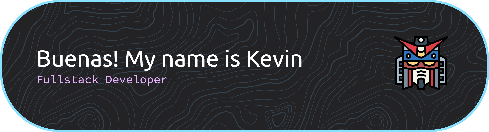

<!--
**Alke-14/Alke-14** is a ✨ _special_ ✨ repository because its `README.md` (this file) appears on your GitHub profile.

Here are some ideas to get you started:

- 🔭 I’m currently working on ...
- 🌱 I’m currently learning ...
- 👯 I’m looking to collaborate on ...
- 🤔 I’m looking for help with ...
- 💬 Ask me about ...
- 📫 How to reach me: ...
- 😄 Pronouns: ...
- ⚡ Fun fact: ...
-->

I'm currently a Computer Science Senior student @ Texas A&M San Antonio and graduating this upcoming Fall 2026. 
- 🌱 Currently teaching myself Linux and Backend Development through Boot.dev 
- 🔭 Interested in Web Development and building applications that everyone and anyone can enjoy
- ⚡ If I'm not coding, I'm probably building Gunpla or out biking/rock climbing

     

<h3 align="center">Frontend</h3>

  

<h3 align="center">Backend</h3>

  

<h3 align="center">Other</h3>

  

<h3 align="center">Offscreen Grinding</h3>

  

